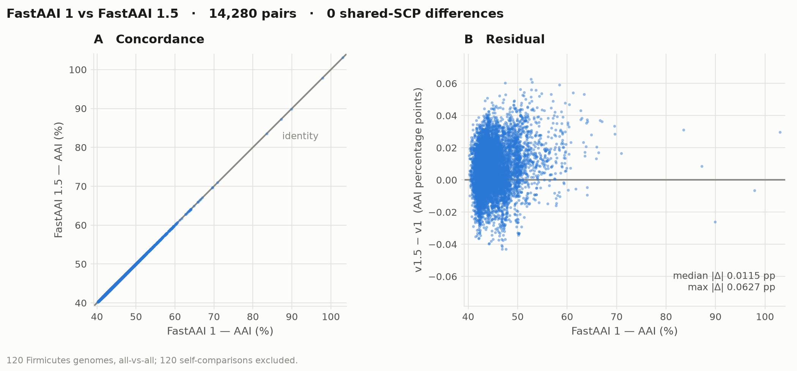

# Methods

Reproducible artifacts behind claims made in the top-level README.

## `concordance_v1_v15.{tsv,png}`

Does FastAAI 1.5 change the answers? 120 Firmicutes genomes, all-vs-all against
FastAAI 1 driven through its own `aai_index` module, 14,400 pairs.

    python plot_concordance.py [concordance_v1_v15.tsv] [out.png]

| | |
|---|---|
| pairs compared (off-diagonal) | 14,280 |
| **shared-SCP differences** | **0** |
| median \|Δ AAI\| | 0.0115 percentage points |
| max \|Δ AAI\| | 0.0627 percentage points |

Panel A is v1 against v1.5 with the identity line for reference. Panel B is the
residual, at a scale where deviations of this size are legible.

The versions differ in the alphabet that reaches the k-merizer. FastAAI 1
encodes the stop symbol `*` and ambiguous residues `X` as residues: its
filtering k-merizer (`unique_kmers`, `fastaai.py:1421`) resolves tetramers
through a `kmer_index` lookup that is never built, and the function is never
called; the numpy transform that runs instead (`unique_kmer_simple_key`,
`fastaai.py:1139`) takes `ord()` of every character. Checked against v1's own
`genome_acc_kmer_counts`: 4,019 of 4,021 stored counts match a 21-symbol
encoding exactly. FastAAI 1.5 uses the 20 canonical amino acids.

Self-comparisons are excluded: Jaccard is 1.0 in both versions, and the AAI
regression is unbounded above, so they land near 150% and compress the 40–70%
band into a corner.

## `timings_{preprocessing.tsv,search.txt}`

Measured, not extrapolated. Two earlier estimates of the search speedup — 3x
from a model of v1's kernel, 74x from a 120-genome run — both missed; the
number below comes from building a real FastAAI 1 database at 2,943 genomes
and querying it against itself.

    python timings.py <genome_dir> <models.hmm> [n_genomes] [threads]

**Preprocessing**, per genome, one thread each (the pipeline parallelises
across genomes, so `cpus=1` is the figure that composes). 24 Firmicutes:

| stage | median s/genome | share |
|---|---|---|
| predict (pyrodigal) | 1.79 | 64% |
| hmmsearch (pyhmmer) | 1.03 | 36% |

Unchanged in 1.5 beyond the move to in-process libraries — it is the same
Prodigal and the same HMMER, and it still dominates a cold run.

**Search**, 8 threads, wall clock less the ~0.22 s interpreter start both
versions pay:

Throughput per thread, which is what compares across machines and thread counts.

| scale | pairs | v1 | v1.5 | v1 /s/thread | v1.5 /s/thread |
|---|---|---|---|---|---|
| 120 genomes | 14,400 | 1.15 s | 0.016 s | 1,565 | 112,500 |
| **2,943 genomes** | **8,661,249** | **21.84 s** | **1.587 s** | **49,572** | **682,203** |

FastAAI 1's published in-memory figure is ~100k comparisons/s/thread and this
machine measured it at 49,572, so the speedup is 13.8x against the measured v1
and 6.8x against the published one. The lower figure is the one to quote until
v1 is re-measured on hardware where it reaches its published throughput.

**14x is the honest headline.** The two rows are not in tension: at 120
genomes the pairwise work is trivial and v1's per-query `TEMP TABLE` +
`INNER JOIN` overhead is most of the runtime, so 74x measures fixed cost.
At 2,943 genomes the work dominates.

v1 was run through `db_query --in_memory --store_results`, its fastest path.
At 2,943 genomes it peaked at 1.01 GB RSS against a 116 MB v1.5 index, and
its database occupies 508 MB on disk to v1.5's 116 MB.

## Reproducing

The v1 side needs FastAAI 1 and its bundled SCP HMMs. The v1.5 side rebuilds
from an archive of proteins and raw HMM hits, so re-filtering or re-scoring
costs seconds rather than repeating a half-hour preprocess:

    fastaai build <genomes> --hmm <models.hmm> --archive arch/ -d db/
    python ../tests/equivalence_v1.py <v1_results_dir> arch/
